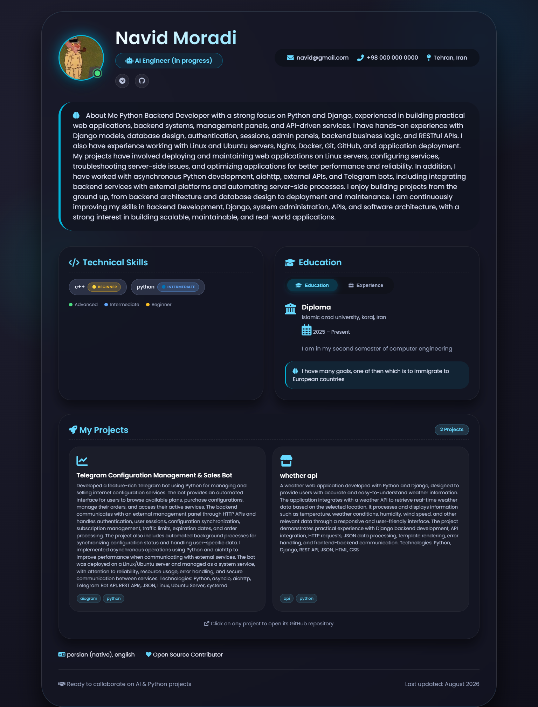

# Developer Resume Website

A personal resume and portfolio website built with **Django**, designed for developers and programmers.

The website provides a simple way to present personal information, skills, projects, profile information, and contact details. The available content can be managed through the **Django Admin Panel**.

> Currently available in English.

## Screenshot



## Features

* Developer-focused resume website
* Responsive design
* Profile information
* Profile image
* Skills and technologies
* Projects
* Career information
* Education information
* Social and contact information
* Content management through Django Admin
* Image upload support
* Docker support
* Production deployment with Gunicorn and Caddy
* Automatic HTTPS with Caddy
* Automated server installation script

## Built With

* Python
* Django
* HTML
* CSS
* JavaScript
* Docker
* Gunicorn
* Caddy

## Project Structure

```text
portfolio-website/
│
├── deploy/
│   ├── Caddyfile
│   ├── docker-compose.prod.yml
│   └── install.sh
│
├── media/
│   └── profile_images/
│
├── resume_app/
│   ├── migrations/
│   ├── templates/
│   │   └── portfolio.html
│   ├── admin.py
│   ├── apps.py
│   ├── models.py
│   ├── tests.py
│   ├── urls.py
│   └── views.py
│
├── resume_project/
│   ├── asgi.py
│   ├── settings.py
│   ├── urls.py
│   └── wsgi.py
│
├── screenshots/
│   ├── home.png
│   ├── download (3).png
│   ├── download (4).png
│   ├── download (6).png
│   └── download (7).png
│
├── static/
│   ├── css/
│   │   └── portfolio.css
│   ├── images/
│   │   └── profile.jpg
│   └── js/
│       └── portfolio.js
│
├── Dockerfile
├── docker-compose.yml
├── manage.py
├── requirements.txt
├── .gitignore
└── README.md
```

## Admin Panel

The website uses Django Admin to manage the available resume content.

After deployment, the admin panel is available at:

```text
https://your-domain.com/admin/
```

From the admin panel, you can manage the content provided by the application without directly editing the HTML templates.

## Server Deployment

The project includes an automated installer for deploying the website on a Linux server.

### Requirements

* Linux server
* A domain or subdomain
* DNS pointing to the server
* Ports `80` and `443` available

Docker and Docker Compose can be installed automatically by the installer if they are not already available.

### 1. Clone the Repository

```bash
git clone https://github.com/navidmn56/portfolio-website.git
cd portfolio-website
```

### 2. Run the Installer

```bash
chmod +x deploy/install.sh
sudo ./deploy/install.sh
```

The installer asks for the domain and automatically handles the main deployment steps, including:

* Detecting the server IP
* Checking DNS
* Creating the production environment
* Building the Docker image
* Starting Django
* Running migrations
* Collecting static files
* Starting Gunicorn
* Starting Caddy
* Obtaining the SSL certificate
* Enabling HTTPS

After installation, the website will be available at:

```text
https://your-domain.com
```

And the admin panel:

```text
https://your-domain.com/admin/
```

## Creating an Admin Account

After the installation is complete, create a Django superuser:

```bash
docker compose \
  -f docker-compose.yml \
  -f deploy/docker-compose.prod.yml \
  exec web python manage.py createsuperuser
```

Follow the prompts to create the administrator account.

## Updating the Website

After making changes and pushing them to GitHub, update the server:

```bash
cd ~/portfolio-website
git pull
```

Rebuild the Docker container:

```bash
docker compose \
  -f docker-compose.yml \
  -f deploy/docker-compose.prod.yml \
  up -d --build
```

Apply new migrations if required:

```bash
docker compose \
  -f docker-compose.yml \
  -f deploy/docker-compose.prod.yml \
  exec web python manage.py makemigrations
```

```bash
docker compose \
  -f docker-compose.yml \
  -f deploy/docker-compose.prod.yml \
  exec web python manage.py migrate
```

Collect static files:

```bash
docker compose \
  -f docker-compose.yml \
  -f deploy/docker-compose.prod.yml \
  exec web python manage.py collectstatic --noinput
```

## Useful Commands

Check the running containers:

```bash
docker compose \
  -f docker-compose.yml \
  -f deploy/docker-compose.prod.yml \
  ps
```

View logs:

```bash
docker compose \
  -f docker-compose.yml \
  -f deploy/docker-compose.prod.yml \
  logs -f
```

Restart the application:

```bash
docker compose \
  -f docker-compose.yml \
  -f deploy/docker-compose.prod.yml \
  restart
```

Stop the application:

```bash
docker compose \
  -f docker-compose.yml \
  -f deploy/docker-compose.prod.yml \
  down
```

## Environment Variables

Production configuration is generated on the server.

Sensitive values such as the Django secret key should not be committed to GitHub.

The `.env` file should remain on the server and should be excluded from Git using `.gitignore`.

## Project Status

The project is currently under development.

The current version focuses on an English-language developer resume and portfolio experience. Additional customization options and features may be added in future versions.

## License

This project is licensed under the MIT License.
